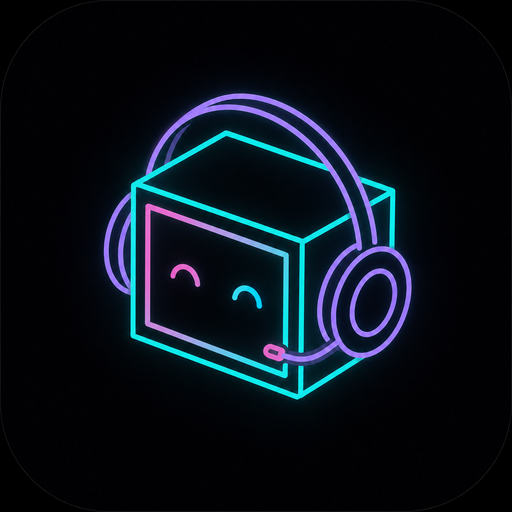

# A.R.I. — Audiological Roaming Intelligence

A minimalist, generative web experience. An isometric neon android roams the grid
with a wearable synth rig, making beats on the spot. Every now and then a visitor
steps up on A.R.I.'s right side, requests a genre — and performs on it.

**Live demo:** https://nachtaap.github.io/A.R.I./  
**Best experienced with sound on.**



Everything runs from a single HTML file. No build step, no JavaScript framework,
no audio samples. The app uses the Web Audio API for synthesized sound, inline SVG
for the scene, a tiny service worker for app-shell caching, and Google Fonts for
typography.

## ⚠️ Disclaimer

**This is an unofficial fan tribute inspired by [ARIatHOME](https://www.youtube.com/@ARIatHOME),
the NYC street musician and streamer.** It is not affiliated with, endorsed by, or
connected to ARIatHOME in any way. No music, recordings, samples, footage, names,
or likenesses from ARIatHOME are used — all audio is synthesized live in the
browser with the Web Audio API, and all visuals are original line art.

If you enjoy this, go watch the real thing. It's better.

## How it works

**The scene** is procedural SVG line art in an isometric projection: A.R.I. with
headphones and headset mic, a hip-mounted flightcase rig (jog wheel, pads, keys,
faders, the corner monitor), backpack speakers, NYC-style street-sign outlines,
and comic sound dashes pulsing on the beat.

**The music** is fully generative. Each track (1–3 minutes) picks a genre — boom
bap, trap, jerk, drum n bass, 2000s rnb, or house — which sets the BPM range,
drum patterns, swing, bass synthesis (saw / 808 / sub / round) and harmony style
(pads, keys, or house stabs). Drums, bass, chords and leads are all synthesized
per-note with the Web Audio API and scheduled with a 25 ms lookahead loop.

**The visitors** arrive at random, each with a generated look (color, height,
outfit, headwear) and a coiled cable plugged into the rig. A visitor requests a
genre — spoken out loud in a retro robotic voice, with A.R.I. answering back —
then A.R.I. crossfades into a fresh track in that style, and the visitor
performs: usually on the mic, sometimes on sax, flute, acoustic or electric guitar,
and rarely on violin or spacy e-violin. Very occasionally, a second visitor joins
and a tiny cypher forms.

The speech is [SAM (Software Automatic Mouth)](https://github.com/discordier/sam),
the 1982 C64 speech synthesizer ported to JavaScript by Christian Schiffler (MIT),
inlined so the experience stays self-contained.

## Running it locally

Open `index.html` in a browser. That's it.

For the screen wake lock to work (keeps the display on during a stream), serve it
over `https` or `localhost` — for example:

```bash
npx serve .
```

Tap A.R.I. to start the stream. Space toggles play/pause.

## Installing as an app

Served over https (GitHub Pages works), A.R.I. is an installable PWA:

- **Android / Chrome**: menu → "Install app" (or the install prompt). The
  `manifest.webmanifest`, icons and `sw.js` service worker make it installable
  and cache the app shell for offline-ish startup.
- **iOS / Safari**: share sheet → "Add to Home Screen". Runs standalone with the
  dark status bar.

Keep `index.html`, `manifest.webmanifest`, `sw.js`, `apple-touch-icon.png`,
`icon-192.png`, `icon-512.png`, `icon-maskable-192.png`, `icon-maskable-512.png`,
`favicon-32.png` and `favicon-16.png` together in the same directory.

## Current version

- Version 8 release: livestream logic, comfort/pitch limits, calmer intros, stronger album art variation, and cleaner visitor flow.
- Visible footer tribute: `version 8`.
- Service worker cache: `ari-v21`.
- Rare cypher copy: `A cypher is forming`, shown only during the rare two-visitor moment.
- Album art now has stronger contrast and more background variation, including occasional light covers.
- Intros are calmer now: no high hats, risers, visitor solos or plucky high-frequency chaos before the beat has settled.
- Comfort limit added: lead/chord pitches are clamped, harsh hats/risers are softened, and sparse tracks get a subtle safety bed.

## License

Code: MIT. See [`LICENSE`](LICENSE).

The tribute nature of the project (see disclaimer) applies to the concept and
inspiration; everything in this repository is original work unless explicitly
credited above.

- Street-sign fix: the right-side blades now overlap the pole slightly so they connect cleanly.

- Livestream logic pass: visitors now request, wait for the intro/drop, perform audibly, and only then leave.
- Rare two-track visitors are explicit now: they can stay for one extra beat after they have actually performed.
- Musical floor added so tracks should not collapse into a lonely kick-only loop.
- Comfort pass tightened further: high flute/violin/vocal transpositions, SAM voices and cowbell/autotune edges are softened.
- Layout fix: track info now uses symmetrical left/right margins so the text no longer runs too close to the right edge on mobile.

- Production guard: every non-intro bar now has an audible musical floor, and visitors cannot silently appear/disappear without clearly performing.

- Genre-aware sections: rap/R&B use verse/hook, house uses groove/peak/breakdown, and drum n bass uses rollout/drop/breakdown/second drop.
